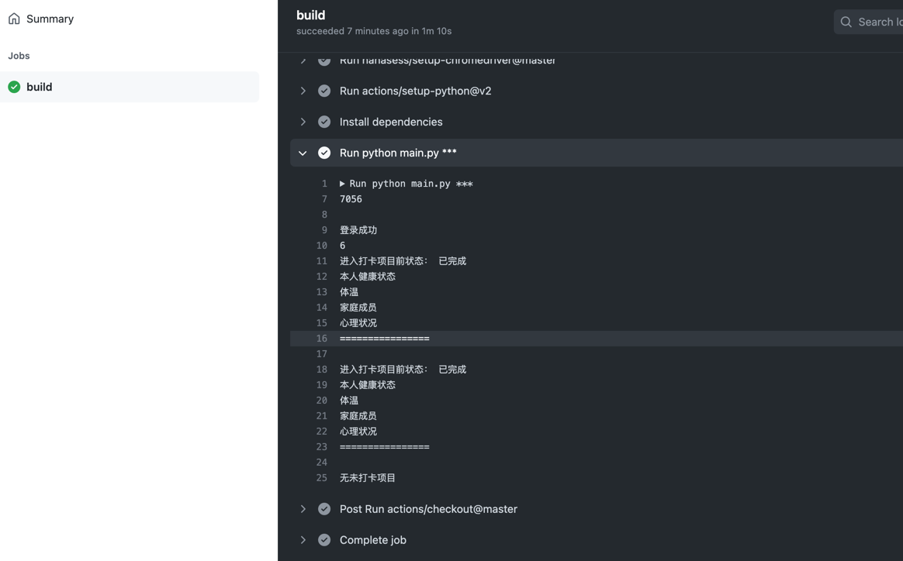

# CUG 14天打卡 GitHub Action

*测试中*

## 如何使用

1. `Fork` 当前仓库。
2. `Settings\Secrets\New secret` 新建名为 `CUG`，值为 `学号(空格)密码`的条目（[智慧校园统一身份认证系统](http://sfrz.cug.edu.cn/tpass/login?service=http%3A%2F%2Fxyfw.cug.edu.cn%2Ftp_up%2F)）。
3. 理论上如果打卡不成功会导致`GitHub Action`失败，然后GitHub会自动发邮件告诉你。
4. 如果打卡未成功需手动重启 `workflow`，同时更新上游代码`fetch upstream`。

## 已知问题
连到国内网速慢了一点，使用模拟浏览器的方法容易超时。。。